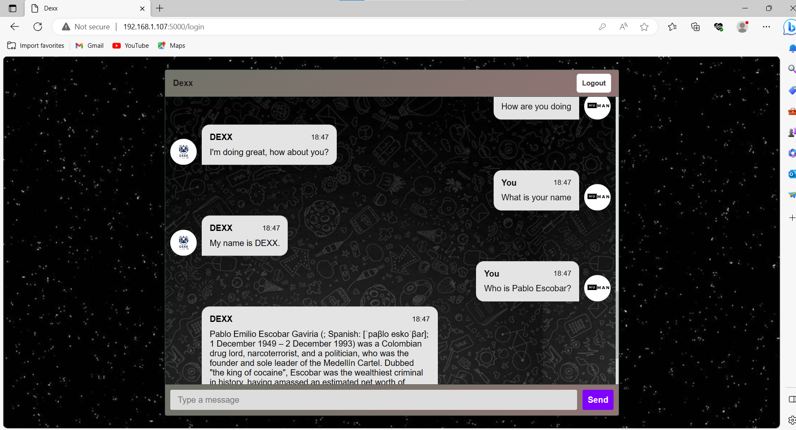

## Dexx

An interactive chatbot to chat with you 24/7

## Installation

pip install -r requirements.txt

Python EXECUTION and Web api EXECUTION: Run main.py to run the bot,once it runs, open the link sign up or sign in and start chatting with the bot...

## Chatbot
AIML (Artificial Intelligence Markup Language) is an XML-based language used for creating software agents that can understand natural language. Chatbots have gained significant popularity in recent times, particularly on e-commerce websites, and many organizations are implementing them.

Some well-known examples of chatbots include Replika, Watson Assistant, Alexa, Dialogflow, and Cleverbot. If you're interested in building your own chatbot, AIML can be a useful tool.We will be using AIML with NLP/ML/Machine Learning to build a chatbot.

Here you will need following files and folders:

main.py: 
code for running the app

data folder: 
Data folder contains all the AIML files Each aiml file contains the conversation patterns which the kernel will load for chatting 

Website folder:
Contains the html css and flask files

Pythonfiles folder:
Contains the python files for machine Learning,nlp,prolog

## Demo

    

